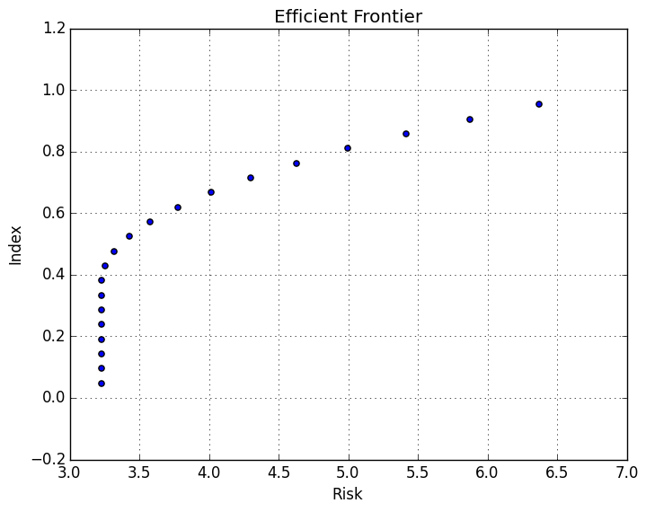

.. _tut-eff:

****************************
Efficient Frontier Tutorial
****************************

One of the most common things to do with portfolio optimization is the making of efficient 
frontiers with the results. This tutorial will guide you through making an efficient frontier 
function, that will allow you to test a SimpleMVO model with multiple target returns values 
to build your efficient frontier. 

Refer to the :ref:`Getting Started <tut-getting_started>` tutorial to see how to import the package.

This tutorial will also utilze the `PyPlot <https://github.com/stevengj/PyPlot.jl>`_ julia package. 
Follow the installation instruction on the page to install PyPlot. 
If you don't wish to utilize PyPlot, then just remove the `using PyPlot` line in the code below, and skip the :ref:`plotting <plotting-label>` stage of the tutorial.

To get started, we will generate some randomized data as the assets in this tutorial. 
We will also generate the same set of constraints as in the :ref:`Getting Started <tut-getting_started>` tutorial.

.. code:: julia
    
    using JuPOT
    using PyPlot
    
    # Generate synthetic data sets for Demonstration
    ############
    # Assets
    ############
    n = 10 # No. Of Assets
    returns = rand(n)
    covarariance = let
        S = randn(n, n)
        S'S + eye(n)
    end
    names = [randstring(3) for i in 1:n] # List of asset names
    
    # Assets data structure containing, names, expected returns, covarariance
    assets = AssetsCollection(names, returns, covarariance)

    function genTechIndicator()
    	[0,0,1,1,0,1,0,1,1,0]
    end
    
    # Adding a simple weight constraint
    constraints = Dict((:constraint1 => :(dot(w,tech) <= tech_thresh)),
                       (:constraint2 => :(dot(w,fin) <= Fin_thresh)))
    parameters = Dict(:tech=>genTechIndicator(), 
                      :tech_thresh => 0.3,
                      :fin=> [1,1,0,0,1,0,1,0,0,0],
                      :Fin_thresh => 0.05)

Once we have prepared all of the above data, we can set an array of values that we want to 
test as the target returns. We do this by creating an array of 20 Float64's. 
This array can be any number you desire. We are also just generating a set of test numbers 
through a simple for loop. This array can be manually set for more specific tests, or set
through a different function that you may create.

.. code:: julia
	
	number = 20

    target_ret_test = Array(Float64, number)
    
    for i in 1:number
        target_ret_test[i] = i/(number+1)
    end

Now we want to create a function for the efficient frontier. This would take in the array of 
target returns that we have just created as well as the assets, constraints and parameters to be tested with.

In the below function, we have defined a for loop to loop over all the values in the ``target_ret_test`` that
we have created and run a Simple MVO optimization with each as the target return and saving the resulting objective value 
and the target return into the risk and index arrays respectively.

Refer to the `Julia Functions Documentation <http://docs.julialang.org/en/release-0.4/manual/functions/>`_ for more information
on how functions work.

.. code:: julia

    function efficientFrontierMVO(assets, constraints, parameters, target_ret_test)

    	# Create the Arrays to be returned, and set them to be the length of the
    	# target_ret_test from the input.
    	n = length(target_ret_test)
        risk = Array(Float64,n)
        index = Array(Float64,n)
    
        for i in 1:n
            # Get the target return we want to test.
            target_ret = target_ret_test[i]

            # Setup and Optimize the SimpleMVO with the new Target Return.
            mvo = SimpleMVO(assets, target_ret, constraints; short_sale=true)
            result = optimize(mvo, parameters)

            # Risk is the Objective Value. Index the Target Return.
            risk[i] = result[1]
            index[i] = target_ret
        end
    	
    	# Return as a Tuple of the Arrays
        return risk, index
    end

Now we run the function we have created with the input values we want.

.. code:: julia

    efd = efficientFrontierMVO(assets, constraints, parameters, target_ret_test)

The Output would be returned with the efd[1] as the risk, and efd[2] as the index. 
As we defined in the function.

.. parsed-literal::

    ([0.2645424881219168,0.26454248812191666,0.26454248812191655,0.26454248812191683,0.2645424881219165,0.26454248812191694,0.26454248812191616,0.2645424881219117,0.26454248812188763,0.2645424881219167,0.26454248812191167,0.2645424881219167,0.2645838415692574,0.297721166359914,0.3926131559583445,0.5492598343057091,0.7676612015879053,1.0478172377918054,1.389727957451198,1.7933933593218339],[0.047619047619047616,0.09523809523809523,0.14285714285714285,0.19047619047619047,0.23809523809523808,0.2857142857142857,0.3333333333333333,0.38095238095238093,0.42857142857142855,0.47619047619047616,0.5238095238095238,0.5714285714285714,0.6190476190476191,0.6666666666666666,0.7142857142857143,0.7619047619047619,0.8095238095238095,0.8571428571428571,0.9047619047619048,0.9523809523809523])

.. note::

	Remember this is sample data, yours may be different due to the random nature of it's generation.

Plotting the Efficient Frontier
-------------------------------

.. _plotting-label:

Finally let's plot the efficient frontier to see how it looks!

.. note::

	We are utilizing the PyPlot Julia package to do plots.

.. code:: julia

    p = scatter(efd[1], efd[2])
    xlabel("Risk")
    ylabel("Index")
    title("Efficient Frontier")
    grid("on")

.. note::

	Your plot may look different depending on the randomized data that was generated.

Now you have created a function in Julia, you can keep using the same function, with multiple different parameters and assets.
This is a great way to speed up your future work, as you won't need to keep rewriting code, but only calling a single function
to create any new efficient frontiers.

